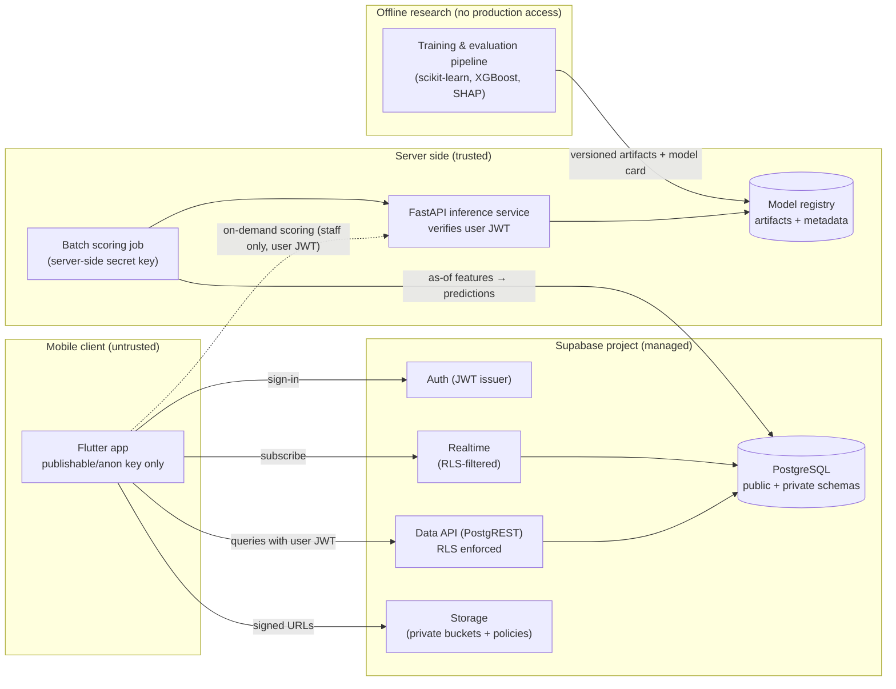

# System Architecture

> Status: **PROPOSED v0.1**. No component in this document exists yet. The only existing external resource is the Supabase project at `https://rzekfmfuskknadrchkhg.supabase.co`. Its schema, region and settings have **not** been inspected (no API key or dashboard access was available during phase 0).

## 1. Components



## 2. Trust boundaries

| Boundary | Rule |
|---|---|
| Flutter client | **Untrusted.** Holds only the Supabase URL and the publishable (anon) key. All authorisation happens in the database (RLS) or on the server. |
| Supabase Data API | Every table in an exposed schema has RLS enabled and explicit policies. Helper functions for authorisation live in a **non-exposed** `private` schema. |
| FastAPI service | Verifies the Supabase-issued JWT on every request that comes from a user. Uses the server-side secret (service-role) key **only** for the batch job's writes. That key is never returned in a response or logged. |
| Research environment | Works on benchmark, synthetic or approved de-identified exports. Has **no** credentials for production Supabase. |

## 3. Primary data flows

### 3.1 Data ingestion (phase 2+)
An institution admin imports academic records (terms, courses, enrolments, attendance and assessments) through an admin-only path.

- Each record stores its **event time** (when it happened) and its **recorded time** (when the system learned it). This is required for leakage-safe, as-of feature computation.

### 3.2 Scoring (phase 4)
1. The batch job runs on a schedule at each decision point *t*.
2. For each active enrolment it calls the **shared as-of feature function**, which uses records with `recorded_at ≤ t`. This is the same code that is used for training, to avoid training/serving skew.
3. It writes a row to `feature_snapshots`, tagged with `feature_version`.
4. It calls the model and writes a row to `risk_predictions`. The row contains: the score, the risk band, the top-k explanation factors, `model_version_id`, `feature_snapshot_id` and `scored_at`.
5. Realtime notifies subscribed mentors, subject to RLS. They see only their assigned students.

### 3.3 Review and intervention (phase 5)
1. A mentor opens a flagged student. The app shows the risk band, the explanation factors (each linked to source values the mentor can check) and the caveat wording.
2. The app suggests interventions from a catalogue, based on explanation factors and rules (not a second black-box model).
3. The mentor chooses, records and follows up. Everything is audited.
4. Outcomes are recorded later, so that the analysis in RQ6 is possible.

## 4. Why predictions are pre-computed rather than computed in the client

- The client never needs model access or feature logic.
- Every displayed score comes from a stored, versioned, auditable row.
- It reduces the attack surface. The on-demand FastAPI path is optional, staff-only, and verified by JWT.

## 5. Repository layout (proposed)

```
/apps/mobile/            Flutter app (feature-first structure)
/services/ml-api/        FastAPI inference service + batch scoring job
/ml/                     Research pipeline: data loaders, as-of features, training, evaluation
  /ml/data/              Local datasets — git-ignored, never committed
/supabase/               Supabase CLI project: migrations/, tests/ (pgTAP), seed (synthetic only)
/docs/                   Research, architecture, database, ML and security documentation
```

The as-of feature code must live in **one** place and be imported by both `/ml` and `/services/ml-api`. For example, it could be a small internal package such as `/ml/sews_features`. Duplicating it risks training/serving skew.

## 6. Environments

| Environment | Supabase | Data allowed |
|---|---|---|
| local | Local Supabase stack (requires Docker, **not currently installed**) or a separate dev project | synthetic only |
| staging | A separate Supabase project (**[OPEN]**: to be created) | synthetic only |
| production | `rzekfmfuskknadrchkhg` (**[OPEN]**: confirm that this is intended as production, not dev) | institutional, under agreement |

Migrations are applied through the Supabase CLI in the order local → staging → production. Nobody edits the schema through the dashboard without recording a migration.

## 7. Cross-cutting concerns

- **Observability:** structured logs without personal data; the scoring job records run IDs; the model's version is visible on every prediction.
- **Failure behaviour:** if scoring fails, the app shows "no current signal (last updated …)". It never falls back to a stale or default score without saying so.
- **UI states:** every screen handles loading, success, empty and error states explicitly.
