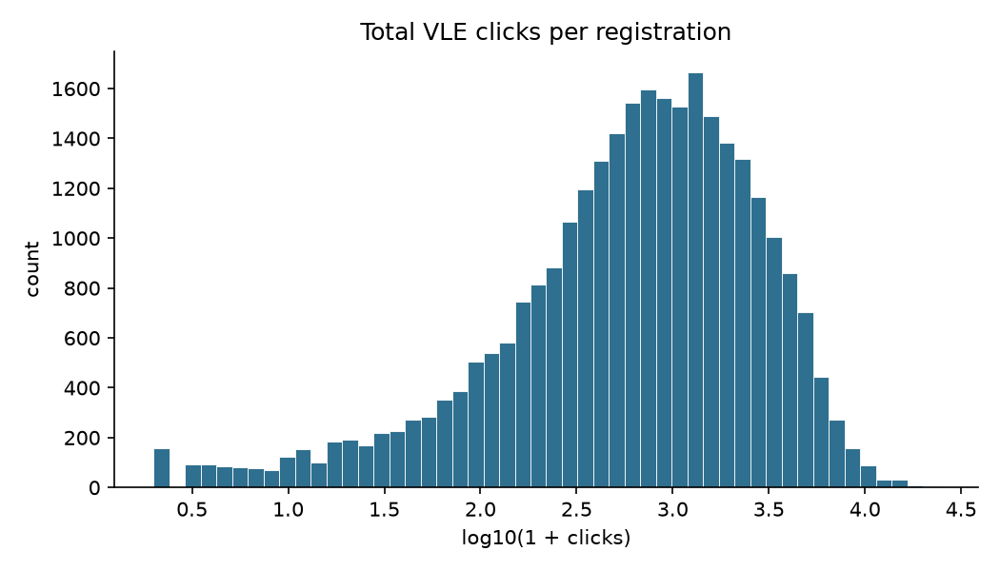
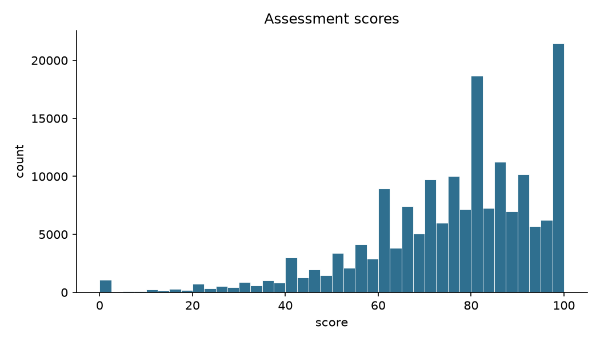
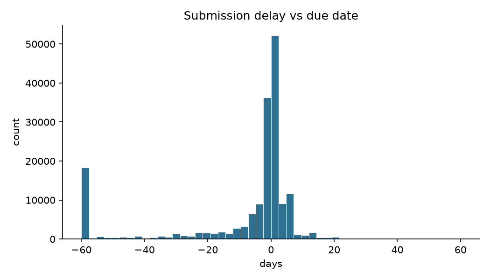
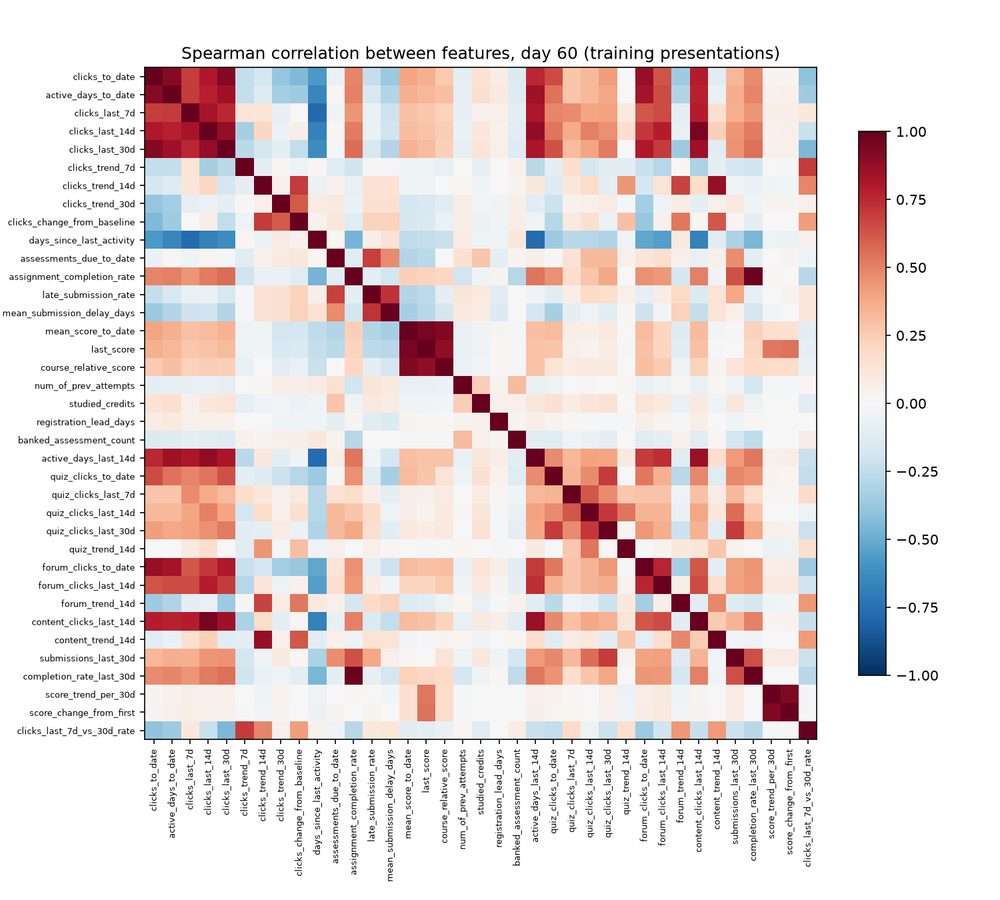
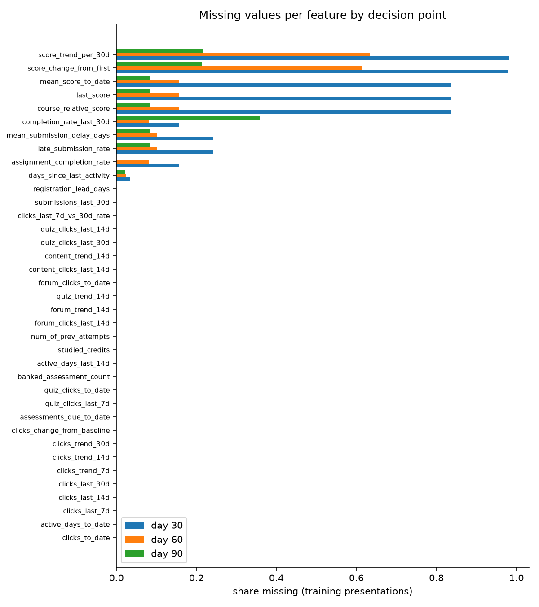

# Exploratory data analysis — OULAD (20261003T093048Z)

> **Provenance: BENCHMARK** — Open University, UK, 2013–2014 (CC BY 4.0). Not Indian data.
> Feature–outcome relationships are deliberately not shown (pre-registered hypotheses H2 and H6 are tested in week 6). Feature tables are profiled on the training presentations only.

- Dataset version `oulad-f853d3b6b35de756`; feature set `oulad-fs-2.0.0` (37 features)
- Training presentations profiled: 2013B, 2013J; decision points: day 30, day 60, day 90
- Outliers: share of values beyond Tukey's outer fences (Q1 − 3·IQR, Q3 + 3·IQR)

## 1. Source files

| file | rows | columns | missing cells | columns with missing | duplicate rows |
|---|---|---|---|---|---|
| courses.csv | 22 | 3 | 0 | none | 0 |
| assessments.csv | 206 | 6 | 11 | date (11) | 0 |
| vle.csv | 6,364 | 6 | 10,486 | week_from (5,243), week_to (5,243) | 0 |
| studentInfo.csv | 32,593 | 12 | 1,111 | imd_band (1,111) | 0 |
| studentRegistration.csv | 32,593 | 5 | 22,566 | date_registration (45), date_unregistration (22,521) | 0 |
| studentAssessment.csv | 173,912 | 5 | 173 | score (173) | 0 |
| studentVle.csv | 10,655,280 | 6 | 0 | none | 787,170 |

*Table: `tables/source_files.csv`*

## 2. Data-quality checks

| check | value |
|---|---|
| Registrations (student × module presentation) | 32,593 |
| Distinct students | 28,785 |
| Students with more than one registration | 3,538 |
| Duplicate registration keys | 0 |
| Unregistration date present but result not 'Withdrawn' | 9 |
| Result 'Withdrawn' but no unregistration date | 93 |
| Registration date missing | 45 |
| Assessment submissions | 173,912 |
| Submissions with missing score | 173 |
| Scores outside 0-100 | 0 |
| Banked submissions (carried over from an earlier attempt) | 1,909 |
| Assessments with no due date | 11 |
| IMD band labels without a '%' sign (inconsistent coding) | 10-20 |

*Table: `tables/quality_checks.csv`*

## 3. Outcome by presentation

| code_presentation | Pass | Distinction | Fail | Withdrawn | registrations | adverse share (Fail or Withdrawn) |
|---|---|---|---|---|---|---|
| 2013B | 1,768 | 327 | 1,241 | 1,348 | 4,684 | 0.553 |
| 2013J | 3,726 | 749 | 2,001 | 2,369 | 8,845 | 0.494 |
| 2014B | 2,574 | 784 | 1,833 | 2,613 | 7,804 | 0.570 |
| 2014J | 4,293 | 1,164 | 1,977 | 3,826 | 11,260 | 0.515 |

*Table: `tables/outcome_by_presentation.csv`*

## 4. Raw distributions

| index | n | missing share | mean | std | min | p25 | median | p75 | max | skewness | far-out share |
|---|---|---|---|---|---|---|---|---|---|---|---|
| total VLE clicks per registration | 29,228 | 0 | 1,355.040 | 1,733.546 | 1 | 260.750 | 739.500 | 1,770 | 24,139 | 2.941 | 0.023 |
| active VLE days per registration | 29,228 | 0 | 61.863 | 54.027 | 1 | 18 | 47 | 92 | 286 | 1.114 | 0 |
| assessment score | 173,739 | 0.001 | 75.800 | 18.798 | 0 | 65 | 80 | 90 | 100 | -1.076 | 0 |
| submission delay (days, negative = early) | 171,047 | 0.016 | -16.658 | 45.946 | -246 | -6 | -1 | 2 | 372 | -2.781 | 0.142 |
| studied credits | 32,593 | 0 | 79.759 | 41.072 | 30 | 60 | 60 | 120 | 655 | 1.876 | 0.001 |

*Table: `tables/raw_distributions.csv`*

*Figure: total VLE clicks per registration (log scale: heavily right-skewed)*

*Figure: distribution of assessment scores (0–100)*

*Figure: submission delay relative to the due date (negative = early; clipped to ±60 days)*

## 5. Feature tables (training presentations)

Missing values are *informative*, not errors: a feature is missing when it is not defined yet at the decision point (for example, no score released by day 30). Logistic regression and random forest fill them with the training median and add a 'was missing' indicator column; XGBoost handles them natively. Far-out values are legitimate behaviour (very active students), so they are kept, not removed.

### Day 30 — 11,759 registrations

| index | family | n | missing share | mean | std | min | p25 | median | p75 | max | skewness | far-out share |
|---|---|---|---|---|---|---|---|---|---|---|---|---|
| clicks_to_date | engagement | 11,759 | 0 | 401.375 | 478.556 | 0 | 95 | 254 | 536.500 | 6,856 | 3.239 | 0.018 |
| active_days_to_date | engagement | 11,759 | 0 | 16.109 | 11.141 | 0 | 7 | 14 | 23 | 49 | 0.642 | 0 |
| clicks_last_7d | engagement | 11,759 | 0 | 61.247 | 91.403 | 0 | 3 | 28 | 84 | 1,850 | 3.785 | 0.020 |
| clicks_last_14d | engagement | 11,759 | 0 | 143.455 | 182.917 | 0 | 24 | 83 | 198 | 3,264 | 3.248 | 0.016 |
| clicks_last_30d | engagement | 11,759 | 0 | 310.122 | 367.575 | 0 | 71.500 | 198 | 419 | 6,265 | 3.316 | 0.016 |
| clicks_trend_7d | engagement | 11,759 | 0 | -2.994 | 12.698 | -169.429 | -6.857 | -0.857 | 1.429 | 258.429 | -0.325 | 0.041 |
| clicks_trend_14d | engagement | 11,759 | 0 | 0.079 | 9.568 | -86.714 | -3.214 | 0 | 3.357 | 133.857 | 0.454 | 0.035 |
| clicks_trend_30d | engagement | 11,759 | 0 | 7.296 | 9.914 | -33.967 | 1.100 | 4.400 | 10.267 | 189.133 | 3.538 | 0.015 |
| clicks_change_from_baseline | engagement | 11,759 | 0 | -0.098 | 9.899 | -270.937 | -3.321 | -0.059 | 3.139 | 132.777 | -1.412 | 0.035 |
| days_since_last_activity | engagement | 11,356 | 0.034 | 3.654 | 6.566 | 0 | 0 | 1 | 5 | 48 | 2.909 | 0.039 |
| assessments_due_to_date | assignment | 11,759 | 0 | 0.939 | 0.500 | 0 | 1 | 1 | 1 | 2 | -0.119 | 0 |
| assignment_completion_rate | assignment | 9,908 | 0.157 | 0.875 | 0.327 | 0 | 1 | 1 | 1 | 1 | -2.268 | 0 |
| late_submission_rate | assignment | 8,909 | 0.242 | 0.134 | 0.302 | 0 | 0 | 0 | 0 | 1 | 2.100 | 0 |
| mean_submission_delay_days | assignment | 8,909 | 0.242 | -13.227 | 36.551 | -236 | -3 | -1 | 0 | 11 | -2.861 | 0.118 |
| mean_score_to_date | academic | 1,913 | 0.837 | 78.863 | 12.060 | 15 | 72 | 80 | 88 | 100 | -0.756 | 0.001 |
| last_score | academic | 1,913 | 0.837 | 78.812 | 12.200 | 15 | 72 | 80 | 88 | 100 | -0.709 | 0.001 |
| course_relative_score | academic | 1,913 | 0.837 | -0.000 | 11.194 | -63.760 | -6.347 | 1.430 | 8.153 | 21.430 | -0.924 | 0.002 |
| num_of_prev_attempts | prior | 11,759 | 0 | 0.172 | 0.483 | 0 | 0 | 0 | 0 | 5 | 3.505 | 0 |
| studied_credits | prior | 11,759 | 0 | 79.641 | 39.159 | 30 | 60 | 60 | 120 | 420 | 1.712 | 0.001 |
| registration_lead_days | prior | 11,754 | 0.000 | 67.723 | 46.254 | -27 | 30 | 54 | 95 | 310 | 1.023 | 0.000 |
| banked_assessment_count | prior | 11,759 | 0 | 0.058 | 0.552 | 0 | 0 | 0 | 0 | 12 | 12.073 | 0 |
| active_days_last_14d | engagement | 11,759 | 0 | 5.791 | 4.038 | 0 | 2 | 5 | 9 | 14 | 0.324 | 0 |
| quiz_clicks_to_date | quiz | 11,759 | 0 | 33.557 | 73.221 | 0 | 0 | 2 | 25.500 | 1,168 | 4.225 | 0.120 |
| quiz_clicks_last_7d | quiz | 11,759 | 0 | 6.282 | 24.107 | 0 | 0 | 0 | 1 | 717 | 8.075 | 0.133 |
| quiz_clicks_last_14d | quiz | 11,759 | 0 | 15.261 | 41.257 | 0 | 0 | 0 | 3 | 780 | 4.991 | 0.190 |
| quiz_clicks_last_30d | quiz | 11,759 | 0 | 30.753 | 67.658 | 0 | 0 | 1 | 21 | 1,168 | 4.077 | 0.148 |
| quiz_trend_14d | quiz | 11,759 | 0 | 0.076 | 3.378 | -53.143 | -0.071 | 0 | 0.071 | 55.714 | -0.119 | 0.267 |
| forum_clicks_to_date | engagement | 11,759 | 0 | 130.848 | 222.708 | 0 | 15 | 66 | 159 | 3,790 | 5.742 | 0.032 |
| forum_clicks_last_14d | engagement | 11,759 | 0 | 45.305 | 85.414 | 0 | 0 | 19 | 57 | 1,895 | 6.992 | 0.028 |
| forum_trend_14d | engagement | 11,759 | 0 | -0.418 | 4.378 | -73.643 | -1.500 | 0 | 0.571 | 122.357 | 2.407 | 0.055 |
| content_clicks_last_14d | engagement | 11,759 | 0 | 82.889 | 99.145 | 0 | 14 | 49 | 119 | 1,369 | 2.577 | 0.010 |
| content_trend_14d | engagement | 11,759 | 0 | 0.421 | 5.545 | -48.857 | -1.643 | 0 | 2.429 | 54.714 | 0.198 | 0.031 |
| submissions_last_30d | assignment | 11,759 | 0 | 0.926 | 0.673 | 0 | 1 | 1 | 1 | 4 | 0.526 | 0 |
| completion_rate_last_30d | assignment | 9,908 | 0.157 | 0.875 | 0.327 | 0 | 1 | 1 | 1 | 1 | -2.268 | 0 |
| score_trend_per_30d | academic | 212 | 0.982 | 0.311 | 148.943 | -720 | -45.536 | -0.894 | 30 | 690 | -0.007 | 0.094 |
| score_change_from_first | academic | 234 | 0.980 | -0.791 | 11.272 | -42 | -7 | 0 | 6 | 30 | -0.260 | 0 |
| clicks_last_7d_vs_30d_rate | engagement | 11,759 | 0 | -1.588 | 8.019 | -158.838 | -4.412 | -1.100 | 0.726 | 199.952 | 0.871 | 0.038 |

*Table: `tables/features_day30.csv`*

### Day 60 — 11,353 registrations

| index | family | n | missing share | mean | std | min | p25 | median | p75 | max | skewness | far-out share |
|---|---|---|---|---|---|---|---|---|---|---|---|---|
| clicks_to_date | engagement | 11,353 | 0 | 633.752 | 738.865 | 0 | 163 | 405 | 843 | 9,921 | 3.103 | 0.018 |
| active_days_to_date | engagement | 11,353 | 0 | 26.991 | 18.194 | 0 | 12 | 24 | 39 | 79 | 0.560 | 0 |
| clicks_last_7d | engagement | 11,353 | 0 | 37.551 | 69.644 | 0 | 0 | 12 | 44 | 1,309 | 4.356 | 0.044 |
| clicks_last_14d | engagement | 11,353 | 0 | 95.615 | 144.650 | 0 | 11 | 50 | 120 | 3,189 | 4.459 | 0.031 |
| clicks_last_30d | engagement | 11,353 | 0 | 227.501 | 303.312 | 0 | 44 | 132 | 292 | 7,061 | 4.216 | 0.025 |
| clicks_trend_7d | engagement | 11,353 | 0 | -2.930 | 10.520 | -293.857 | -5.714 | -0.857 | 0.286 | 86.429 | -3.368 | 0.048 |
| clicks_trend_14d | engagement | 11,353 | 0 | -1.215 | 9.589 | -496.643 | -3.500 | -0.143 | 1.714 | 133.786 | -11.893 | 0.044 |
| clicks_trend_30d | engagement | 11,353 | 0 | -2.884 | 7.775 | -138.767 | -5.300 | -1.567 | 0.200 | 229.133 | 0.797 | 0.029 |
| clicks_change_from_baseline | engagement | 11,353 | 0 | -2.856 | 7.935 | -149.299 | -5.524 | -1.726 | 0.081 | 105.992 | -0.329 | 0.028 |
| days_since_last_activity | engagement | 11,092 | 0.023 | 6.442 | 11.627 | 0 | 0 | 2 | 7 | 78 | 2.922 | 0.064 |
| assessments_due_to_date | assignment | 11,353 | 0 | 2.233 | 1.006 | 0 | 2 | 2 | 3 | 4 | -0.397 | 0 |
| assignment_completion_rate | assignment | 10,434 | 0.081 | 0.859 | 0.305 | 0 | 1 | 1 | 1 | 1 | -2.019 | 0 |
| late_submission_rate | assignment | 10,204 | 0.101 | 0.233 | 0.296 | 0 | 0 | 0 | 0.500 | 1 | 1.059 | 0 |
| mean_submission_delay_days | assignment | 10,204 | 0.101 | -14.157 | 33.911 | -236 | -3 | -0.500 | 0.667 | 41 | -2.213 | 0.170 |
| mean_score_to_date | academic | 9,566 | 0.157 | 74.821 | 14.268 | 0 | 67 | 77 | 85 | 100 | -0.974 | 0.001 |
| last_score | academic | 9,566 | 0.157 | 74.107 | 15.374 | 0 | 65 | 76 | 86 | 100 | -0.925 | 0.001 |
| course_relative_score | academic | 9,566 | 0.157 | 0.000 | 13.476 | -80.138 | -7.170 | 1.903 | 9.552 | 29.885 | -1.063 | 0.002 |
| num_of_prev_attempts | prior | 11,353 | 0 | 0.170 | 0.478 | 0 | 0 | 0 | 0 | 5 | 3.468 | 0 |
| studied_credits | prior | 11,353 | 0 | 79.002 | 38.737 | 30 | 60 | 60 | 120 | 420 | 1.737 | 0.001 |
| registration_lead_days | prior | 11,348 | 0.000 | 67.523 | 46.281 | -49 | 30 | 53 | 95 | 310 | 1.022 | 0.000 |
| banked_assessment_count | prior | 11,353 | 0 | 0.060 | 0.561 | 0 | 0 | 0 | 0 | 12 | 11.863 | 0 |
| active_days_last_14d | engagement | 11,353 | 0 | 4.781 | 3.927 | 0 | 1 | 4 | 8 | 14 | 0.615 | 0 |
| quiz_clicks_to_date | quiz | 11,353 | 0 | 57.720 | 116.484 | 0 | 1 | 14 | 62 | 2,242 | 4.804 | 0.062 |
| quiz_clicks_last_7d | quiz | 11,353 | 0 | 4.320 | 22.791 | 0 | 0 | 0 | 0 | 998 | 15.044 | 0 |
| quiz_clicks_last_14d | quiz | 11,353 | 0 | 11.664 | 42.754 | 0 | 0 | 0 | 3 | 1,387 | 10.811 | 0.180 |
| quiz_clicks_last_30d | quiz | 11,353 | 0 | 23.516 | 61.411 | 0 | 0 | 2 | 18 | 1,518 | 6.850 | 0.097 |
| quiz_trend_14d | quiz | 11,353 | 0 | 0.134 | 3.252 | -35.714 | -0.071 | 0 | 0.071 | 92.429 | 6.170 | 0.336 |
| forum_clicks_to_date | engagement | 11,353 | 0 | 200.547 | 340.197 | 0 | 29 | 107 | 243 | 6,186 | 6.019 | 0.031 |
| forum_clicks_last_14d | engagement | 11,353 | 0 | 25.314 | 62.156 | 0 | 0 | 8 | 28 | 1,187 | 8.035 | 0.038 |
| forum_trend_14d | engagement | 11,353 | 0 | -0.804 | 3.330 | -77.286 | -1.643 | -0.071 | 0.071 | 42.714 | -2.047 | 0.050 |
| content_clicks_last_14d | engagement | 11,353 | 0 | 58.636 | 86.214 | 0 | 5 | 28 | 78 | 2,177 | 4.189 | 0.025 |
| content_trend_14d | engagement | 11,353 | 0 | -0.545 | 6.927 | -496.857 | -1.714 | 0 | 1.143 | 61.786 | -32.487 | 0.064 |
| submissions_last_30d | assignment | 11,353 | 0 | 1.251 | 0.792 | 0 | 1 | 1 | 2 | 4 | 0.024 | 0 |
| completion_rate_last_30d | assignment | 10,434 | 0.081 | 0.821 | 0.371 | 0 | 1 | 1 | 1 | 1 | -1.674 | 0 |
| score_trend_per_30d | academic | 4,155 | 0.634 | -11.003 | 136.386 | -1,590 | -12 | -2.069 | 6.429 | 1,440 | -1.702 | 0.117 |
| score_change_from_first | academic | 4,399 | 0.613 | -2.514 | 13.619 | -82 | -10 | -2 | 5 | 75 | -0.239 | 0.004 |
| clicks_last_7d_vs_30d_rate | engagement | 11,353 | 0 | -2.219 | 6.763 | -233.081 | -4.214 | -1.362 | 0 | 84.800 | -3.655 | 0.039 |

*Table: `tables/features_day60.csv`*

*Figure: feature–feature Spearman correlation at day 60 (redundancy, not outcome association)*

Feature pairs with |ρ| ≥ 0.9 at day 60 (near-duplicates: tree models are unaffected, linear coefficients become unstable):

| feature A | feature B | Spearman rho |
|---|---|---|
| assignment_completion_rate | completion_rate_last_30d | 0.980 |
| clicks_last_14d | content_clicks_last_14d | 0.952 |
| mean_score_to_date | last_score | 0.946 |
| score_trend_per_30d | score_change_from_first | 0.935 |
| mean_score_to_date | course_relative_score | 0.924 |
| clicks_to_date | clicks_last_30d | 0.915 |
| clicks_to_date | active_days_to_date | 0.907 |

*Table: `tables/strong_feature_pairs_day60.csv`*

### Day 90 — 11,052 registrations

| index | family | n | missing share | mean | std | min | p25 | median | p75 | max | skewness | far-out share |
|---|---|---|---|---|---|---|---|---|---|---|---|---|
| clicks_to_date | engagement | 11,052 | 0 | 773.479 | 917.615 | 0 | 194 | 479 | 1,010 | 10,289 | 2.974 | 0.021 |
| active_days_to_date | engagement | 11,052 | 0 | 34.526 | 24.268 | 0 | 15 | 30 | 50 | 109 | 0.675 | 0 |
| clicks_last_7d | engagement | 11,052 | 0 | 40.348 | 84.053 | 0 | 0 | 13 | 47 | 4,536 | 16.523 | 0.042 |
| clicks_last_14d | engagement | 11,052 | 0 | 66.614 | 119.951 | 0 | 0 | 27 | 79 | 4,536 | 7.942 | 0.039 |
| clicks_last_30d | engagement | 11,052 | 0 | 137.712 | 220.588 | 0 | 13 | 63 | 160 | 4,715 | 4.400 | 0.043 |
| clicks_trend_7d | engagement | 11,052 | 0 | 2.012 | 10.903 | -81.143 | -0.143 | 0 | 3.429 | 648 | 20.270 | 0.091 |
| clicks_trend_14d | engagement | 11,052 | 0 | 0.291 | 7.880 | -174 | -1.071 | 0 | 2.071 | 311.214 | 4.251 | 0.084 |
| clicks_trend_30d | engagement | 11,052 | 0 | -3.044 | 7.081 | -232.300 | -4.533 | -1.567 | 0 | 148.767 | -4.866 | 0.032 |
| clicks_change_from_baseline | engagement | 11,052 | 0 | -3.343 | 8.186 | -126.584 | -5.532 | -1.948 | -0.104 | 311.143 | 3.537 | 0.033 |
| days_since_last_activity | engagement | 10,813 | 0.022 | 11.210 | 19.448 | 0 | 0 | 2 | 12 | 108 | 2.297 | 0.067 |
| assessments_due_to_date | assignment | 11,052 | 0 | 3.089 | 1.398 | 1 | 2 | 3 | 3 | 6 | 0.759 | 0 |
| assignment_completion_rate | assignment | 11,052 | 0 | 0.820 | 0.309 | 0 | 0.667 | 1 | 1 | 1 | -1.698 | 0 |
| late_submission_rate | assignment | 10,139 | 0.083 | 0.232 | 0.289 | 0 | 0 | 0 | 0.500 | 1 | 1.075 | 0 |
| mean_submission_delay_days | assignment | 10,139 | 0.083 | -15.626 | 34.698 | -236 | -4 | -0.500 | 0.667 | 61 | -1.944 | 0.193 |
| mean_score_to_date | academic | 10,105 | 0.086 | 75.861 | 13.687 | 0 | 68.667 | 78.667 | 85.667 | 100 | -1.172 | 0.003 |
| last_score | academic | 10,105 | 0.086 | 79.046 | 17.953 | 0 | 68 | 80 | 94 | 100 | -0.912 | 0 |
| course_relative_score | academic | 10,105 | 0.086 | -0.000 | 13.078 | -79.305 | -6.878 | 2.318 | 9.064 | 32.318 | -1.164 | 0.003 |
| num_of_prev_attempts | prior | 11,052 | 0 | 0.169 | 0.477 | 0 | 0 | 0 | 0 | 5 | 3.460 | 0 |
| studied_credits | prior | 11,052 | 0 | 78.469 | 38.336 | 30 | 60 | 60 | 91.250 | 420 | 1.752 | 0.013 |
| registration_lead_days | prior | 11,047 | 0.000 | 67.361 | 46.206 | -69 | 30 | 53 | 94 | 310 | 1.014 | 0.000 |
| banked_assessment_count | prior | 11,052 | 0 | 0.060 | 0.563 | 0 | 0 | 0 | 0 | 12 | 11.815 | 0 |
| active_days_last_14d | engagement | 11,052 | 0 | 3.458 | 3.496 | 0 | 0 | 2 | 5 | 14 | 1.055 | 0 |
| quiz_clicks_to_date | quiz | 11,052 | 0 | 73.665 | 146.576 | 0 | 2 | 20 | 75 | 2,593 | 4.918 | 0.071 |
| quiz_clicks_last_7d | quiz | 11,052 | 0 | 4.539 | 21.273 | 0 | 0 | 0 | 0 | 830 | 15.646 | 0 |
| quiz_clicks_last_14d | quiz | 11,052 | 0 | 7.311 | 27.760 | 0 | 0 | 0 | 2 | 921 | 13.271 | 0.193 |
| quiz_clicks_last_30d | quiz | 11,052 | 0 | 15.806 | 50.128 | 0 | 0 | 0 | 13 | 2,034 | 13.894 | 0.080 |
| quiz_trend_14d | quiz | 11,052 | 0 | -0.017 | 2.796 | -140 | 0 | 0 | 0.071 | 61.071 | -10.253 | 0.310 |
| forum_clicks_to_date | engagement | 11,052 | 0 | 232.507 | 408.056 | 0 | 32 | 120 | 278 | 7,353 | 6.144 | 0.032 |
| forum_clicks_last_14d | engagement | 11,052 | 0 | 13.474 | 41.898 | 0 | 0 | 0 | 12 | 1,269 | 11.572 | 0.063 |
| forum_trend_14d | engagement | 11,052 | 0 | -0.140 | 2.410 | -35.714 | -0.286 | 0 | 0.071 | 60.429 | 1.773 | 0.193 |
| content_clicks_last_14d | engagement | 11,052 | 0 | 45.829 | 90.453 | 0 | 0 | 14 | 54 | 4,531 | 13.526 | 0.042 |
| content_trend_14d | engagement | 11,052 | 0 | 0.448 | 5.832 | -117.500 | -0.500 | 0 | 1.429 | 313.357 | 13.375 | 0.105 |
| submissions_last_30d | assignment | 11,052 | 0 | 0.596 | 0.699 | 0 | 0 | 0 | 1 | 4 | 0.908 | 0 |
| completion_rate_last_30d | assignment | 7,096 | 0.358 | 0.649 | 0.442 | 0 | 0 | 1 | 1 | 1 | -0.617 | 0 |
| score_trend_per_30d | academic | 8,654 | 0.217 | 2.805 | 37.666 | -1,260 | -5.143 | 2.394 | 11.059 | 1,440 | 6.635 | 0.011 |
| score_change_from_first | academic | 8,679 | 0.215 | 4.953 | 17.916 | -82 | -6 | 3 | 17 | 78 | -0.005 | 0.000 |
| clicks_last_7d_vs_30d_rate | engagement | 11,052 | 0 | 1.174 | 7.962 | -74.695 | -1.014 | 0 | 2.220 | 490.833 | 22.548 | 0.063 |

*Table: `tables/features_day90.csv`*

## 6. Missing values by decision point

*Figure: share of missing values per feature at each decision point*

## 7. Composition by audit attribute (never model inputs)

| attribute | group | share |
|---|---|---|
| gender | M | 0.548 |
| gender | F | 0.452 |
| age_band | 0-35 | 0.704 |
| age_band | 35-55 | 0.289 |
| age_band | 55<= | 0.007 |
| disability | N | 0.903 |
| disability | Y | 0.097 |
| imd_band | 20-30% | 0.112 |
| imd_band | 30-40% | 0.109 |
| imd_band | 10-20 | 0.108 |
| imd_band | 0-10% | 0.102 |
| imd_band | 40-50% | 0.100 |
| imd_band | 50-60% | 0.096 |
| imd_band | 60-70% | 0.089 |
| imd_band | 70-80% | 0.088 |
| imd_band | 80-90% | 0.085 |
| imd_band | 90-100% | 0.078 |
| imd_band | missing | 0.034 |
| highest_education | A Level or Equivalent | 0.431 |
| highest_education | Lower Than A Level | 0.404 |
| highest_education | HE Qualification | 0.145 |
| highest_education | No Formal quals | 0.011 |
| highest_education | Post Graduate Qualification | 0.010 |

*Table: `tables/audit_attribute_composition.csv`*
