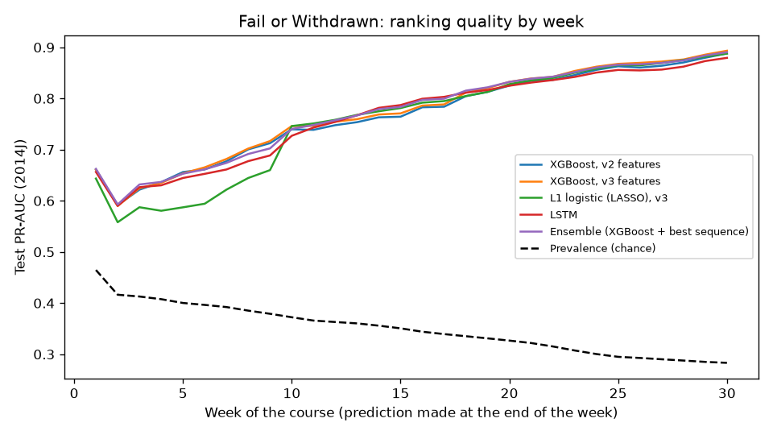
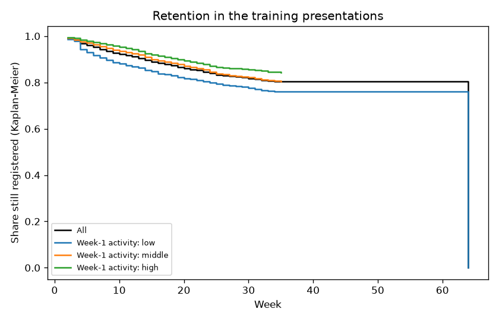
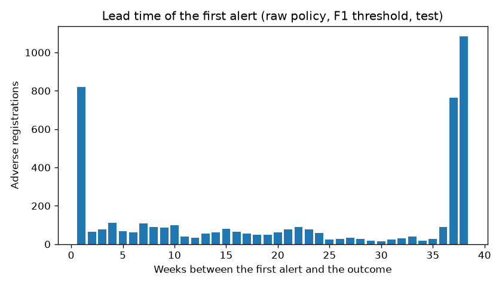
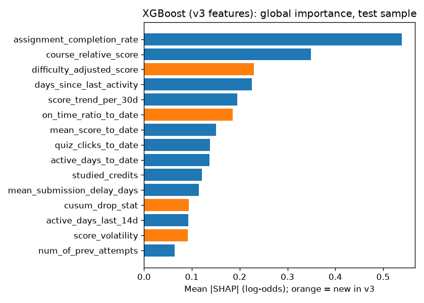

# EWS v3 longitudinal study — oulad-ts-v3-20261005T192442Z

> **Provenance: BENCHMARK** — Open University Learning Analytics Dataset (United Kingdom, 2013-2014; CC BY 4.0; UCI id 349). NOT Indian data. Dataset version `oulad-f853d3b6b35de756`.
> These results describe the method on this dataset, not Indian students. Benchmark-trained
> models are never approved for real students.

Plan and pre-specified comparisons: `docs/research/ews-v3-longitudinal-plan.md`. Leakage guard: passed at weeks 2, 4, 8, 13, 20, 30.

## 1. Panel

Feature set `oulad-ts-1.0.0`: 55 features (37 v2 + 18 longitudinal). Weeks 1-30. Registrations recorded as Withdrawn without a date (excluded from the withdrawal horizons only): 93.

| Split | Presentations | Student-weeks | Registrations | Fail/Withdrawn | Withdraw ≤ 4 wk | Withdraw ≤ 8 wk |
|---|---|---:|---:|---:|---:|---:|
| train | 2013B, 2013J | 327,208 | 12,209 | 0.398 | 0.026 | 0.048 |
| validation | 2014B | 177,307 | 6,767 | 0.432 | 0.032 | 0.057 |
| test | 2014J | 252,842 | 10,201 | 0.353 | 0.031 | 0.055 |

**Retention (Kaplan-Meier, training presentations, 12,180 registrations, 2,399 withdrawals):** week 4: 0.967, week 8: 0.936, week 13: 0.905, week 20: 0.861, week 30: 0.818. By week-1 activity tertile at week 13: low 0.863, middle 0.919, high 0.934.

## 2. Fail or Withdrawn, predicted every week

| Model | Validation PR-AUC | Test PR-AUC [95% CI] | Test ROC-AUC | Test Brier | Test ECE |
|---|---:|---:|---:|---:|---:|
| XGBoost, v2 features | 0.861 | 0.764 [0.752, 0.776] | 0.833 | 0.159 | 0.051 |
| XGBoost, v3 features | 0.863 | 0.769 [0.758, 0.781] | 0.836 | 0.157 | 0.050 |
| L1 logistic (LASSO), v3 | 0.857 | 0.754 [0.742, 0.766] | 0.827 | 0.159 | 0.042 |
| Random forest, v3 | 0.864 | 0.775 [0.765, 0.787] | 0.839 | 0.153 | 0.054 |
| GRU | 0.866 | 0.765 [0.754, 0.776] | 0.836 | 0.158 | 0.062 |
| LSTM | 0.866 | 0.762 [0.750, 0.773] | 0.834 | 0.159 | 0.061 |
| TCN | 0.865 | 0.762 [0.750, 0.773] | 0.837 | 0.157 | 0.042 |
| Ensemble (XGBoost + best sequence) | 0.867 | 0.770 [0.758, 0.781] | 0.838 | 0.156 | 0.055 |
| Prevalence baseline | 0.432 | 0.353 [0.343, 0.363] | 0.500 | 0.230 | 0.045 |

Selected by validation PR-AUC: **Ensemble (XGBoost + best sequence)**. Best sequence model: LSTM. Test prevalence 0.353.

## 3. Pre-specified comparisons (Holm-corrected)

| ID | Comparison | Effect [95% CI] | p | Holm p | Result |
|---|---|---|---:|---:|---|
| P1 | XGBoost oulad-ts-1.0.0 minus XGBoost v2 features, test PR-AUC (one-sided) | 0.0053 [0.0042, 0.0065] | < 0.001 | 0.002 | supported |
| P2 | best sequence model (lstm) minus XGBoost oulad-ts-1.0.0, test PR-AUC (two-sided) | -0.0078 [-0.0102, -0.0054] | < 0.001 | 0.002 | supported |
| P4 | student-level false-alarm rate, raw minus 2-consecutive-week policy (F1 threshold, one-sided) | 0.0988 [0.0910, 0.1067] | < 0.001 | 0.002 | supported |
| P5 | degradation(L1 logistic) - degradation(XGBoost) per unseen module; one-sided exact Wilcoxon | median -0.0022 (6/7 modules) | 0.055 | 0.055 | not supported |

## 4. Thresholds and alerts (Ensemble (XGBoost + best sequence); thresholds chosen on validation)

| Threshold | Value | Student-week recall | Student-week precision | Student recall | Student false-alarm rate | Median lead (weeks) |
|---|---:|---:|---:|---:|---:|---:|
| f1 | 0.362 | 0.800 | 0.589 | 0.982 | 0.854 | 23.0 |
| f2 | 0.170 | 0.950 | 0.464 | 1.000 | 1.000 | 23.0 |
| cost_2 | 0.342 | 0.821 | 0.576 | 0.986 | 0.886 | 23.0 |
| cost_5 | 0.169 | 0.950 | 0.464 | 1.000 | 1.000 | 23.0 |
| cost_10 | 0.101 | 0.981 | 0.421 | 1.000 | 1.000 | 23.0 |

| Alert policy (F1 threshold) | Student recall | False-alarm rate | Precision | Median lead (weeks) | Lead ≥ 4 weeks | Alert flips per registration |
|---|---:|---:|---:|---:|---:|---:|
| raw | 0.982 | 0.854 | 0.500 | 23.0 | 0.793 | 1.78 |
| consecutive_2 | 0.798 | 0.755 | 0.479 | 33.0 | 0.930 | 1.83 |
| ewma | 0.978 | 0.825 | 0.508 | 23.0 | 0.791 | 1.15 |

Risk tiers (validation quantiles [0.5, 0.75, 0.9]): mean tier changes per registration 2.91 with raw weekly risk, 1.93 with smoothed risk. Deployment default policy: **raw** (consecutive_2 if it loses at most 0.02 student-level recall vs raw, else raw).

## 5. Calibration (XGBoost v3; calibrator fitted on validation)

| | Brier | ECE |
|---|---:|---:|
| raw | 0.157 | 0.050 |
| sigmoid | 0.160 | 0.054 |
| isotonic | 0.156 | 0.049 |

## 6. Fairness (Ensemble (XGBoost + best sequence), F1 threshold, test student-weeks)

| Attribute | Recall gap (lowest group) | FPR gap | Calibration-gap spread |
|---|---:|---:|---:|
| gender | 0.010 (F) | 0.096 | 0.063 |
| age_band | 0.088 (55<=) | 0.100 | 0.025 |
| disability | 0.044 (N) | 0.042 | 0.049 |
| imd_band | 0.106 (unknown) | 0.107 | 0.069 |

Gender recall gap (F minus M): single threshold -0.010 [-0.030, 0.010]; per-group thresholds 0.043 [0.023, 0.062] (precision 0.589 → 0.587; flagged 0.478 → 0.480). Note: analysis only: using gender at decision time is an institutional, ethical and legal choice.

Demographics as inputs (sensitivity only): test PR-AUC 0.769 → 0.771; gender recall gap -0.016 → -0.036.

## 7. Explanations

Top SHAP features (XGBoost v3, test sample): assignment_completion_rate, course_relative_score, difficulty_adjusted_score (v3), days_since_last_activity, score_trend_per_30d, on_time_ratio_to_date (v3), mean_score_to_date, quiz_clicks_to_date, active_days_to_date, studied_credits.

LASSO (C = 0.1): 75 of 77 inputs kept; features zeroed: clicks_trend_14d, completion_rate_last_30d.

Counterfactuals (week 8, 300 flagged student-weeks): one actionable change suffices for 46, two for 23, none found for 231. Most frequent single levers: on_time_ratio_to_date (17), assignment_completion_rate (17), active_days_last_14d (8), days_since_last_activity (4). These show what the model responds to, not causes.

## 8. Uncertainty (MC dropout, LSTM, 30 samples)

Test PR-AUC 0.762; most certain 80%: 0.805; least certain 20%: 0.520; Spearman(uncertainty, |error|) = 0.656.

## 9. Withdrawal within 4 and 8 weeks

**withdraw_4w** — selected xgboost_none; hazard-model derived risk test PR-AUC 0.097.

| Model (imbalance) | Validation PR-AUC | Test PR-AUC [95% CI] | Test ROC-AUC |
|---|---:|---:|---:|
| xgboost_none | 0.089 | 0.112 [0.103, 0.121] | 0.759 |
| xgboost_weights | 0.085 | 0.123 [0.113, 0.133] | 0.756 |
| xgboost_smote | 0.072 | 0.111 [0.103, 0.119] | 0.765 |
| l1_logistic_none | 0.084 | 0.102 [0.094, 0.111] | 0.768 |
| l1_logistic_weights | 0.085 | 0.095 [0.087, 0.102] | 0.764 |
| l1_logistic_smote | 0.085 | 0.098 [0.091, 0.106] | 0.766 |
| lstm | 0.087 | 0.091 [0.084, 0.098] | 0.761 |

**withdraw_8w** — selected xgboost_none; hazard-model derived risk test PR-AUC 0.147.

| Model (imbalance) | Validation PR-AUC | Test PR-AUC [95% CI] | Test ROC-AUC |
|---|---:|---:|---:|
| xgboost_none | 0.148 | 0.140 [0.130, 0.150] | 0.729 |
| xgboost_weights | 0.140 | 0.155 [0.144, 0.167] | 0.730 |
| xgboost_smote | 0.125 | 0.148 [0.139, 0.158] | 0.736 |
| l1_logistic_none | 0.139 | 0.149 [0.137, 0.160] | 0.748 |
| l1_logistic_weights | 0.139 | 0.141 [0.131, 0.151] | 0.745 |
| l1_logistic_smote | 0.140 | 0.145 [0.134, 0.156] | 0.747 |

Concordance (time to withdrawal, test): week 4: hazard model 0.606, direct 8-week model 0.612 (1693 withdrawals / 9124 registrations); week 8: hazard model 0.672, direct 8-week model 0.668 (1358 withdrawals / 8790 registrations).

Largest weekly hazard odds ratios per SD (L1 logistic): inactive_week_streak 0.78, assignment_completion_rate 0.83, studied_credits 1.14, on_time_ratio_to_date 0.89, completion_rate_last_30d 0.90, assessments_due_to_date 0.90.

## 10. Rolling-origin cross-validation

Note: hyperparameters fixed from the hold-out validation (2014B); the fold testing on 2014B is optimistic.

**academic** (test PR-AUC)

| Train → test | l1_logistic | xgboost | LSTM |
|---|---:|---:|---:|
| 2013B → 2013J | 0.810 | 0.813 | 0.807 |
| 2013B+2013J → 2014B | 0.857 | 0.863 | 0.866 |
| 2013B+2013J+2014B → 2014J | 0.758 | 0.776 | 0.770 |
| mean (SD) | 0.808 (0.050) | 0.817 (0.044) | 0.814 (0.049) |

**withdraw_4w** (test PR-AUC)

| Train → test | l1_logistic | xgboost |
|---|---:|---:|
| 2013B → 2013J | 0.063 | 0.055 |
| 2013B+2013J → 2014B | 0.084 | 0.089 |
| 2013B+2013J+2014B → 2014J | 0.099 | 0.105 |
| mean (SD) | 0.082 (0.018) | 0.083 (0.026) |

## 11. Unseen module (leave-one-module-out)

Cross-MODULE proxy within one UK institution; not cross-institution validation. Train 2013B, 2013J, 2014B; evaluate 2014J.

| Module | Model | PR-AUC with module | PR-AUC module unseen | Degradation |
|---|---|---:|---:|---:|
| AAA | l1_logistic | 0.630 | 0.629 | 0.001 |
| BBB | l1_logistic | 0.640 | 0.645 | -0.005 |
| CCC | l1_logistic | 0.812 | 0.803 | 0.009 |
| DDD | l1_logistic | 0.811 | 0.809 | 0.003 |
| EEE | l1_logistic | 0.790 | 0.781 | 0.009 |
| FFF | l1_logistic | 0.832 | 0.825 | 0.007 |
| GGG | l1_logistic | 0.762 | 0.765 | -0.003 |
| AAA | xgboost | 0.645 | 0.640 | 0.006 |
| BBB | xgboost | 0.693 | 0.697 | -0.005 |
| CCC | xgboost | 0.825 | 0.789 | 0.036 |
| DDD | xgboost | 0.823 | 0.819 | 0.004 |
| EEE | xgboost | 0.803 | 0.792 | 0.011 |
| FFF | xgboost | 0.839 | 0.834 | 0.004 |
| GGG | xgboost | 0.776 | 0.771 | 0.006 |

## 12. Drift (training vs test presentation)

16 drift alerts (1 critical). Highest PSI: assessments_due_to_date 0.828, quiz_clicks_last_30d 0.210, late_submission_rate 0.209, quiz_clicks_to_date 0.182, forum_clicks_to_date 0.155.

## 13. Artifacts (git-ignored, benchmark only, never approved for real students)

`ml/artifacts/oulad-ts-v3-20261005T192442Z-acad-xgb-ts` (XGBoost v3; thresholds, alert policy and monitoring reference in its metadata) and `ml/artifacts/oulad-ts-v3-20261005T192442Z-acad-lstm` (sequence model state).

## Charts

